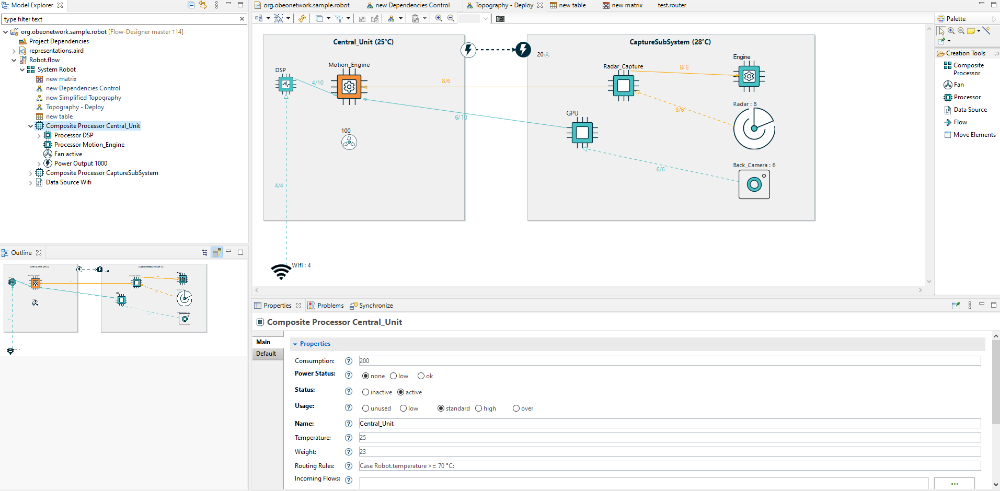

Flow-Designer
=============

This is the Flow Designer sample for Obeo Designer.

To install it, the easiest way is to download [Obeo Designer Community Edition 11.9.0](https://www.obeodesigner.com/en/download) which provides a ready-to-use bundle with Sirius 7.4.5. Just check out this source code, and use a runtime workspace to try the sample with these two projects:
* org.obeonetwork.sample.robot
* fr.obeo.dsl.designer.sample.flow.design

Last change: 
* Upgrade to Sirius 7.4.5 (and OD 11.9.0)
* Update SVGs and icons
* Simplify the VSM for the demo purpose
* Improve the L&F of the sample.
